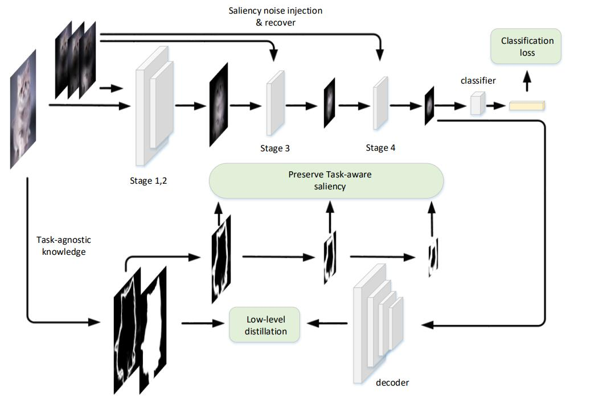

# TASS - Official PyTorch Implementation


### [CVPR 2024] Task-Adaptive Saliency Guidance for Exemplar-free Class Incremental Learning

[Paper](https://arxiv.org/abs/2212.08251)
## Usage

* Training on CIFAR-100 dataset:

```
$ python main.py
```

## Citation
If you use this code for your research, please consider citing:

```
@article{liutask,
  title={Task-Adaptive Saliency Guidance for Exemplar-free Class Incremental Learning},
  author={Liu, Xialei and Zhai, Jiang-Tian and Bagdanov, Andrew D and Li, Ke and Cheng, Ming-Ming}
}
```
